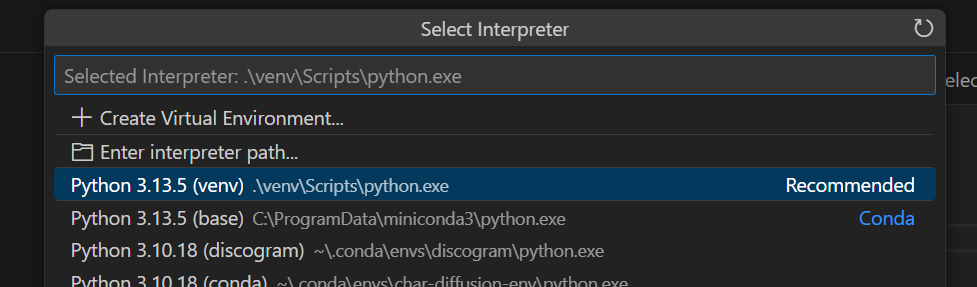

### Как начать:
0. Открыть терминал (Ctrl+Shift+` или через интерфейс)

1. Создать виртуальное окружение для отделения библиотек проекта от оставльных библиотек на устройстве

```
python -m venv venv
```
и 

```
./venv/Scripts/Activate.ps1
```

2. Установить зависимости(библиотеки) из файла requirements.txt

```
pip install -r requirements.txt
```

3. Зайти в любой python файл.

4. нажать сюда.


5. Выбрать рекомендованый вариант с (venv)



6. Писать код.

### Как писать код:

1. Узнать/выбрать какой модуль ты разрабатываешь.

2. Писать код.

3. В коде ОБЯЗАТЕЛЬНО написать это:

```
if __name__ == "__main__":
    #------------------
    # Код для проверки работоспособности всего функционала модуля и выводящий результаты в консоль
    #------------------

    #------------------
    # Код запускающий работу модуля так, что бы модуль работал сам. например при запуске app.py должно открыться окно приложения, но без использования других модулей: respawn_detect.py - нельзя ❌, tray.py - нельзя ❌, все модули из utils можно ✅.
    #------------------
```

### Как добавить зависимость/библиотеку:

1. копируем название зависимости(то, что испольуется при pip install)
2. добавляем в конец requirements.txt новой строкой

### Как_сделать_коммит:

1. Заходишь в github репозиторий проекта https://github.com/tignatov6/AnkiGaming

2. Нажимаешь Add file -> Upload Files


3. Заргужаешь файл, разработкой которого занимаешься.

4. заполняешь краткое название и более подробное описание.

5. Нажимаешь Commit changes


### Как обновить файлы в проекте на актуальные из репозитория:

1. Проверить что текущая версия файла над которым ты работаешь в [репозиторие](https://github.com/tignatov6/AnkiGaming) - последняя(новейшая/та котоорую ты хочешь там видеть) .

2. Если файл в [репозиторие](https://github.com/tignatov6/AnkiGaming) тот, что нужно - пропускай пункт 3.

3. Сделай [коммит](#Как_сделать_коммит) файла над которым ты работаешь. 

4. Нажми сюда.


5. Теперь на кнопку Pull


